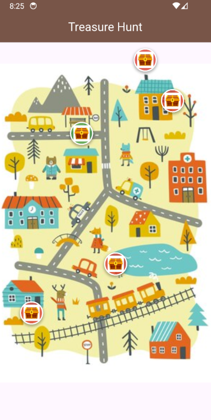
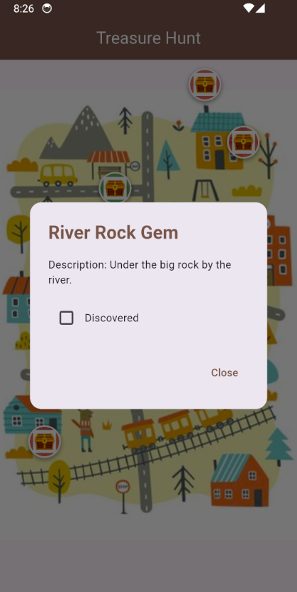

# 🗺️ Flutter Treasure Hunt App

A simple mobile app for an adventure club. Members can find hidden treasures on a static map, view details, mark them as "discovered," and have their progress saved.

---




## ✨ Features

* **Interactive Map**: Pan and zoom on the map image (`assets/map.jpg`).
* **Treasure Markers**: Over 5 markers show treasure locations.
* **Treasure Details**: Tap a marker to see its name, location text, and description.
* **"Discovered" State**: Check a box to mark treasures as found.
* **Persistence**: Discovered states are saved locally using `shared_preferences`.
* No backend, APIs, or map SDKs are used.

---

## 💻 Codebase Overview

This project follows Flutter best practices for a clean, modular, and scalable design:

* **Models (`lib/models`)**: Defines the `Treasure` data structure.
* **Services (`lib/services`)**: Manages data, including `shared_preferences` persistence and providing the static list of treasures.
* **Providers (`lib/providers`)**: Handles application state using the **`provider` package**. It loads treasure data and notifies UI components of "discovered" state changes.
* **Screens (`lib/screens`)**: The main UI (`TreasureHuntScreen`) consumes state from `TreasureProvider` to display the map and markers.
* **Widgets (`lib/widgets`)**: Reusable UI components like `TreasureMarker`.

This architecture ensures clear **separation of concerns** for better maintainability and testability.

### Folder Structure


```plaintext
treasure_hunt_app/
├── lib/   
│   ├── models/
│   │   └── treasure.dart
│   ├── services/
│   │   └── treasure_service.dart
│   ├── screens/
│   │   └── treasure_hunt_screen.dart
│   ├── widgets/
│   │   └── treasure_marker.dart
│   └── providers/
│       └── treasure_provider.dart
├── assets/
│   ├── map.jpg
│   └── treasure_icon.jpg
└── pubspec.yaml
``` 


---

## 🚀 Installation & Setup

1.  **Prerequisites**: [Flutter SDK](https://flutter.dev/docs/get-started/install).
2.  **Navigate to Project**: `cd treasure_hunt_app`.
3.  **Add Assets**: Place `map.jpg` (your `IMG_3677.JPG`) and `treasure_icon.png` (your `IMG_3678.JPG`) in the `assets/` folder.
4.  **Install Dependencies**: `flutter pub get`.
5.  **Run**: `flutter run`.

---

## 🎮 How to Use

* **Pan & Zoom**: Drag to pan, pinch to zoom on the map.
* **View Details**: Tap markers to open treasure info.
* **Mark Discovered**: Check the box in the dialog; marker color changes and state is saved.
